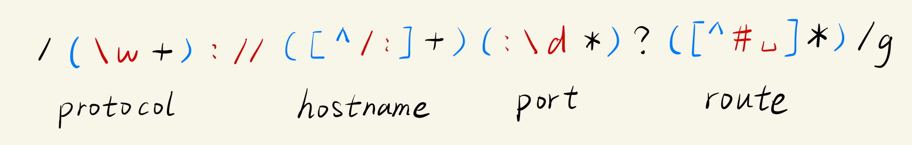

# 实例


1.  0\~255的整数

    ```python
    ((2(5[0-5]|[0-4]\d))|[0-1]?\d{1,2})
    ```
2.  1\~99正整数

    ```python
    [1-9][0-9]?
    ```
3.  电子邮箱

    ```python
    \b\w+@[\w.]+\.[a-zA-Z]{2,6}\b
    ```


    


4.  匹配URL

    ```css
    (\w+)://([^/:]+)(:\d*)?([^# ]*)
    ```

    
5.  匹配HTML标签

    ```css
    <[a-zA-Z].*?>
    ```
6.  匹配C语言单行注释

    ```css
    //.*
    ```
7.  汉字

    ```
    ^[\u4e00-\u9fa5]*$
    ```
